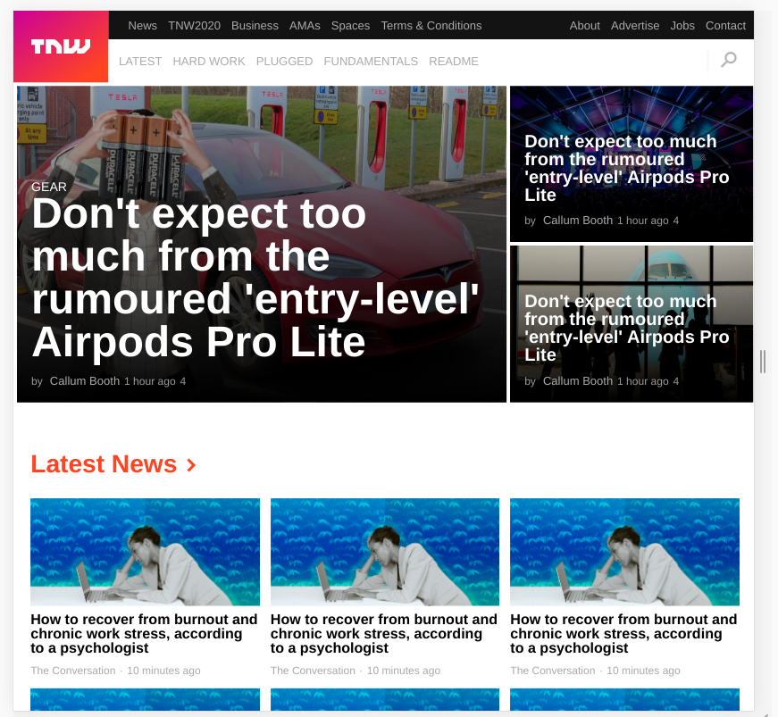

# Responsive web design- Clone of Thenextweb.com

> This project consists of replicating the The Next Web website putting emphasis on how it behaves differently depending on the size of the screen where the website is rendered.

Additional description about the project and its features.

## Built With

- HTML and CSS,
- Flexbox, Grid, Float and Positioning,

## Live Demo

[Live Demo Link](https://livedemo.com)

## Getting Started

**To get a local copy of this project**
**Modify this file to match your project, remove sections that don't apply. For example: delete the testing section if the currect project doesn't require testing.**

To get a local copy up and running follow these simple example steps.

### Prerequisites

### Setup

### Install

### Usage

### Run tests

### Deployment

## Authors

👤 **Ramsey Njire**

- Github: [@RamseyNjire](https://github.com/RamseyNjire)
- Twitter: [@untakenramram](https://twitter.com/untakenramram)
- Linkedin: [Ramsey Njire](https://linkedin.com/ramsey-njire-51984931/)

👤 **Opeyemi Oyelesi**

- Github: [@Opeyemi Oyelesi](https://github.com/Adedayoopeyemi)
- Twitter: [@Oyelesiopy](https://twitter.com/oyelesiopy)
- Linkedin: [Opeyemi Oyelesi](https://linkedin.com//opeyemioyelesi)

## 🤝 Contributing

Contributions, issues and feature requests are welcome!

Feel free to check the [issues page](issues/).

## Show your support

Give a ⭐️ if you like this project!

## Acknowledgments

- Hat tip to anyone whose code was used
- Inspiration
- etc

## 📝 License

This project is [MIT](lic.url) licensed.
